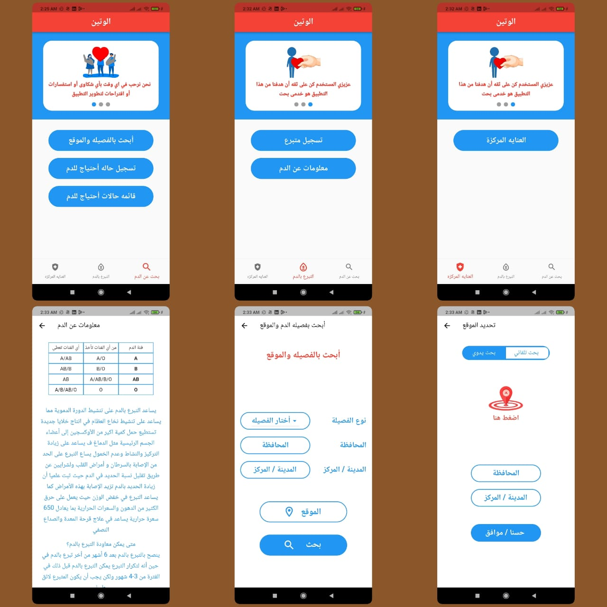
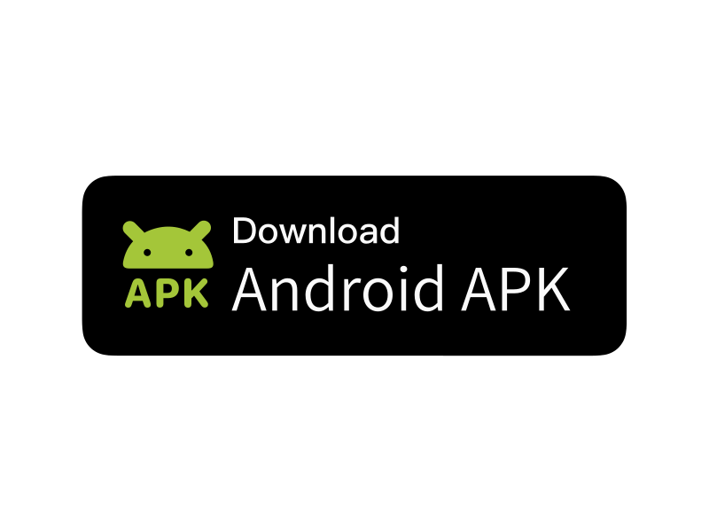

<h2> Hi there, I'm Mohamed Ali Khwass </h2>

### Software Engineer.  
i,am holds a Bachelor's degree in Computer Science, a Programming Engineer and a Mobile Developer. He holds many programming languages.

<i>contact with me:</i> 

 
<h2> Samples from my projects </h2>

 

### Alwateen | الوتين  
تطبيق خدمي بحت  حيث يسهل عليك الوصول الي متبرع دم وقت الطوارئ ويسهل عليك عمليه البحث فمن السهل الوصول الي فصيله الدم التي تحتاجها والكميه التي تريدها بالاضافه انه يمكنك ان تتبرع ايضا للاشخاص المحتاجين وفي حاله طوارئ وايضا يساعدك علي البحث عن الغرف العنايه المتاحه ف اقرب مستشفي لك مع امكانيه التواصل مع المستشفي للحجز او الاستفسار التطبيق في الكثثير من المميزات .
 

<i>Download App:</i> 

 

 

### Zekrak 7esnak | ذكرك حصنك  
تطبيق ديني يوجد في بعد المميزات التي يحتاجها المسلم مثل الاذكار والتسابيح وختم الصلاه وغيرها من المميزات يمتاز التطبيق بتفاعل مع المستخدم اثناء التسابيح والاذكار يجعلك تحافظ علي اذكارك بمجرد تفعيل الاشعارات .
 

<i>Download App:</i> 

