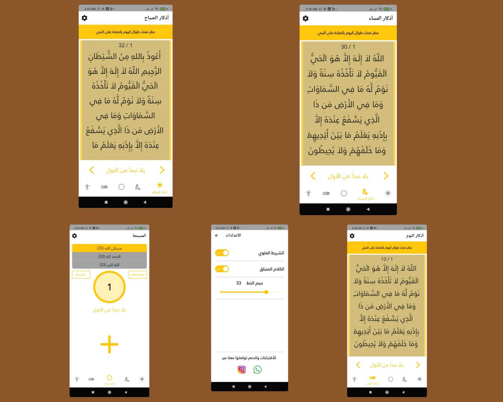

<h2> Hi there, I'm Mohamed Ali Khwass </h2>

### Software Engineer.  
i,am holds a Bachelor's degree in Computer Science, a Programming Engineer and a Mobile Developer. He holds many programming languages.

<i>contact with me:</i> 

<h2> Samples from my projects </h2>

### Zekrak 7esnak.  
i,am holds a Bachelor's degree in Computer Science, a Programming Engineer and a Mobile Developer. He holds many programming languages.

<i>contact with me:</i> 

